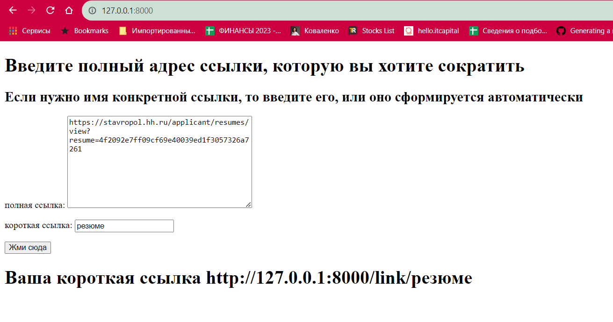

# Тестовое задание для стажера. 

Нужно сделать HTTP сервис для сокращения URL наподобие Bitly и других сервисов.

Должна быть возможность:
1. сохранить короткое представление заданного URL
2. перейти по сохраненному ранее короткому представлению и получить redirect на соответствующий исходный URL

## Запуск:

Скачайте код:
```sh
git clone https://github.com/MaksAnikeev/short_links.git
```

Перейдите в каталог проекта:
```sh
cd short_links
```

## Быстрый старт
Запуск через Докер. У ваз должен быть установлен `docker` и `docker-compose`
```pycon
docker-compose up 
```

[Установите Python](https://www.python.org/), если этого ещё не сделали.

Проверьте, что `python` установлен и корректно настроен. Запустите его в командной строке:
```sh
python --version
```
**Важно!** Версия Python должна быть не ниже 3.6.

Возможно, вместо команды `python` здесь и в остальных инструкциях этого README придётся использовать `python3`. Зависит это от операционной системы и от того, установлен ли у вас Python старой второй версии.

В каталоге проекта создайте виртуальное окружение:
```sh
python -m venv venv
```
Активируйте его. На разных операционных системах это делается разными командами:

- Windows: `.\venv\Scripts\activate`
- MacOS/Linux: `source venv/bin/activate`


Установите зависимости в виртуальное окружение:
```sh
pip install -r requirements.txt
```

Определите переменную окружения `SECRET_KEY`. Создать файл `.env` в каталоге `short_links/` и положите туда такой код:
```sh
SECRET_KEY=django-.......
```

Если вы запускаете проект не на локальном компьютере, а на арендованном сервере,
то необходимо прописать в файле `.env` ip сервера
```pycon
ALLOWED_HOSTS=80.249....
```

Если вы закончили с отладкой и переходите в "боевой" режим, то укажите
в файле `.env`:
```pycon
DEBUG=False
```

Отмигрируйте базу данных на своем компьютере функцией:

```sh
python manage.py migrate
```

Запустите сервер:

```sh
python manage.py runserver
```

По адресу
```pycon
http://127.0.0.1:8000/
```
Вы увидите поле  для ввода url адреса, также вы можете указать
короткое название этой ссылки и нажать кнопку, после чего получите короткую ссылку на указанный вами url

## Цели проекта

Код написан в учебных целях — это урок в курсе по Python и веб-разработке на сайте [Devman](https://dvmn.org).
